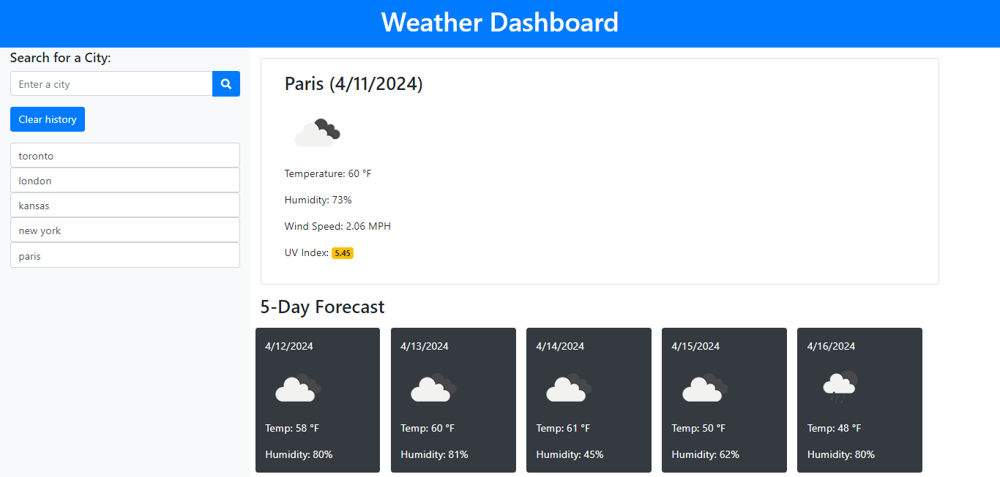

# Module-6-Challenge-Server-Side-API-Weather-Dashboard
Server Side API Weather Dashboard
# Live Link
[Visit my Weather Dashboard](https://jmorris38.github.io/Module-3-Challenge-Employee-Payroll-Tracker/)

## Technologies Implemented
1. Server Side OpenWeather API.
2. BootStrap for Better Frontend.
3. Local Storage to store any persistent data.

## Description 
Required user story: 

AS A traveler
I WANT to see the weather outlook for multiple cities
SO THAT I can plan a trip accordingly

## Website Preview

## Contact me @
[Email](jmorris.38@outlook.com)